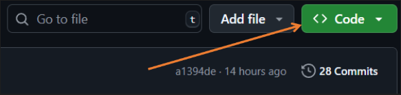
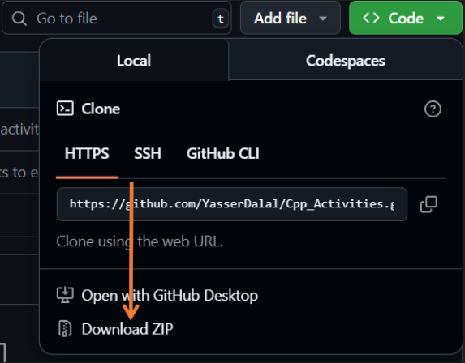
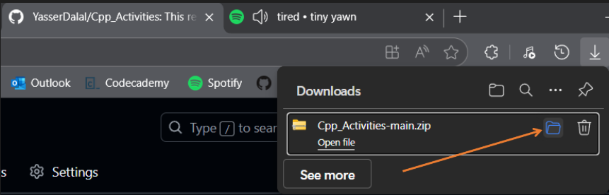
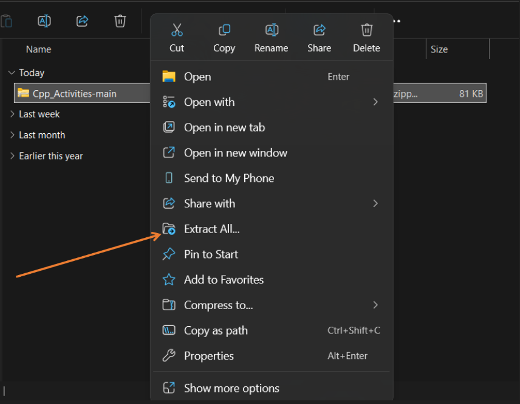
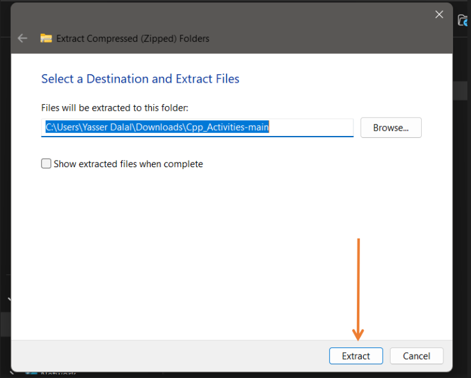
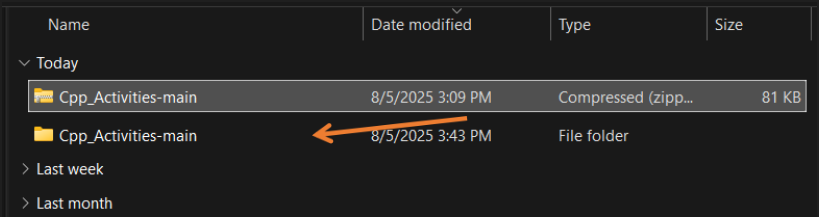

# Hello User!

## I will show you how to clone this repository so you have a copy of it.
 

 1. Once you are in this repository, click on the green Code or Clone button.

  

 

 2. After you click the green button, you will see a feature like this, then click the <code>Download ZIP</code>.

  

 

 3. After you click the Download ZIP button, wait for it to download. then click the <code>ZIP</code> folder location.

  

 

 4. Right click the <code>ZIP folder</code> and then click the <code>Extract All</code>

  

 

 5. Just click the Extract if this window pops up.

  

 

 6. Done! Now you have a copy of this repository, you can now Open this folder in your IDE.

  

